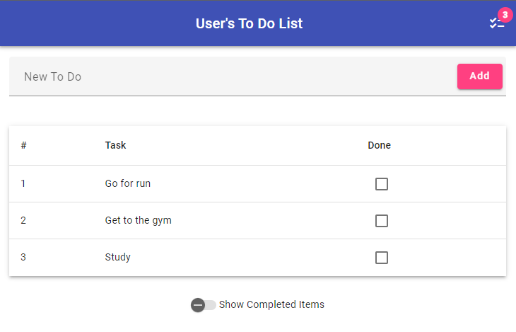

# Angular todo-list
A simple application of a todo-list using angular and angular-material

# Running the application
Navigate to the root folder and type the command:
```
ng serve
```
With the application running access `http://localhost:4200` you should see this page:


